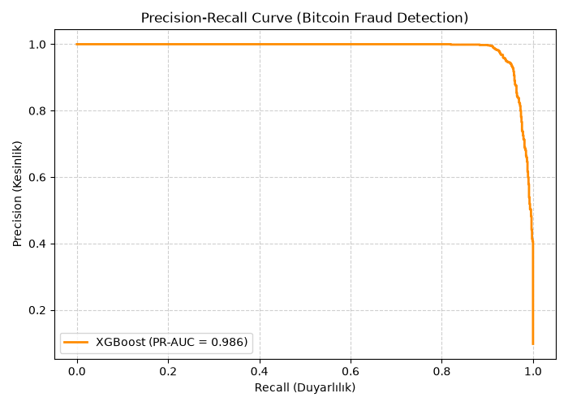
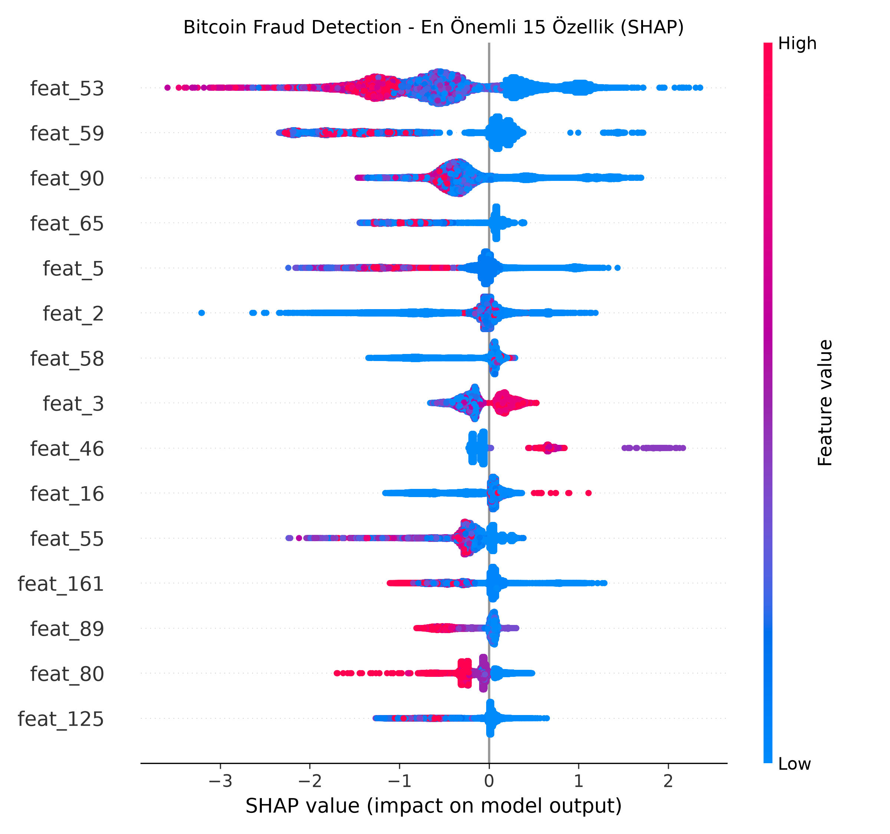

#  Anti-Money Laundering (AML) & Bitcoin Fraud Detection on Elliptic Dataset

This repository contains an end-to-end Machine Learning pipeline to detect fraudulent transactions on the Bitcoin blockchain using the **Elliptic Data Set**. The project addresses real-world financial challenges including severe class imbalance, graph feature extraction, and temporal data leakage.

---

##  Dataset Overview

* **Source:** Elliptic Data Set (203,769 Bitcoin transactions)
* **Classes:** 
  * `Legitimate (0)`: ~90.2%
  * `Fraud (1)`: ~9.8%
  * `Unknown`: ~77% of total network (filtered out for supervised training)
* **Features:** 166 features (local transaction features + aggregated 1-hop neighbor features)

---

##  Methodology & Key Learnings

1. **Handling Class Imbalance:**
   - Evaluated models using **PR-AUC (Precision-Recall Area Under Curve)**, **Recall**, and **F1-Score** instead of misleading accuracy metrics.
   - Configured XGBoost with `scale_pos_weight = Negative / Positive` ratio (~7.63 - 9.24).

2. **Validation Strategy (Temporal Split vs. Random Split):**
   - **Random Split Data Leakage:** A naive `train_test_split` yielded an over-optimistic **95% Recall**, as future and past transactions leaked into training.
   - **Temporal Split (Realistic Evaluation):** Split data chronologically by `time_step` (First 70% for Training, Last 30% for Testing).

---
---

## Graph Feature Hypothesis Test

**Research question:** Do graph-derived features (node degree, PageRank, neighborhood illicit ratio) improve fraud detection beyond the dataset's own local + aggregated features?

Using the same temporal split as above (to keep the comparison fair), two XGBoost models were trained: one on the original 165 features, one with 3 additional graph features computed via NetworkX on the transaction graph.

| Model | PR-AUC | 95% CI (bootstrap, n=1000) |
|---|---|---|
| Baseline (original features) | 0.7996 | (0.7790, 0.8201) |
| Graph-enhanced (+ degree, PageRank, neighborhood illicit ratio) | 0.8680 | (0.8515, 0.8847) |
| **Improvement (Δ)** | **+0.0685** | **(+0.0577, +0.0803)** |

The 95% confidence interval for the difference excludes zero, so the improvement from graph features is statistically significant, not due to chance. This supports the hypothesis that a transaction's position in the network — not just its own attributes — carries meaningful fraud signal.

*See `notebooks/05_graph_vs_baseline.py` for the full implementation.*

---

## Visualizations

**Precision-Recall Curve (Temporal Test)**



**SHAP Feature Importance**



##  Model Performance (Temporal Test)

Below are the test results evaluated on unseen future time steps (Steps 35 to 49):

| Metric | Score |
|---|---|
| **PR-AUC** | **0.7971** |
| **ROC-AUC** | **0.9295** |
| **Fraud Recall** | **74%** (800 / 1,083 fraudulent transactions caught) |
| **Fraud Precision** | **76%** |
| **Fraud F1-Score** | **0.75** |

---

## Repository Structure

```text
bitcoin-fraud-graph-features/
├── data/                       # Raw datasets (Git ignored)
├── notebooks/
│   ├── 01_eda.py               # Exploratory Data Analysis & Filtering
│   ├── 02_train.py             # XGBoost model with random split
│   ├── 03_shap_analysis.py     # Feature Importance & SHAP explanations
│   └── 04_temporal_split.py    # Realistic chronological validation
│   ├── 05_graph_vs_baseline.py # Graph feature hypothesis test (baseline vs graph-enhanced, with bootstrap significance)
├── .gitignore
├── README.md
└── requirements.txt
